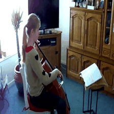

# Video-FocalNets


[](https://twitter.com/search?q=%23FreePalestine&src=typed_query)

[](https://arxiv.org/abs/2307.06947) []([?](https://img.shields.io/badge/keras-2.12-darkred)) [](?) [](?) [](?)


**Video-FocalNet** is an architecture for efficient video recognition that is effectively modeled on both local and global contexts. A spatio-temporal focal modulation approach is utilized, in which self-attention steps are optimized for greater efficiency through cost-effective convolution and element-wise multiplication. After extensive exploration, the parallel spatial and temporal encoding was determined to be the best design choice.

This is a unofficial `Keras` implementation of **Video-FocalNet**. The official `PyTorch` implementation is [here](https://github.com/TalalWasim/Video-FocalNets)

## News

- 1


# Install

```python
git clone https://github.com/innat/Video-FocalNets.git
cd Video-FocalNets
pip install -e . 
```

# Usage

The Video-FocalNet checkpoints are available in both **SavedModel** and **H5** formats. The variants of this models are tiny, small, and base. Check this release and [model zoo](MODEL_ZOO.md) page to know details of it. Following are some hightlights.

**Inference**

```python
>>> from videofocalnet import VideoFocalNetT
>>> model = VideoFocalNetT(name='FocalNetT_K400')
>>> model.load_weights('TFVideoFocalNetT_K400_8x224.h5')
>>> container = read_video('sample.mp4')
>>> frames = frame_sampling(container, num_frames=8)
>>> y = model(frames)
>>> y.shape
TensorShape([1, 400])

>>> probabilities = tf.nn.softmax(y_pred_tf)
>>> probabilities = probabilities.numpy().squeeze(0)
>>> confidences = {
    label_map_inv[i]: float(probabilities[i]) \
    for i in np.argsort(probabilities)[::-1]
}
>>> confidences
```
A classification results on a sample from [Kinetics-400](https://www.deepmind.com/open-source/kinetics).

| Video                          | Top-5 |
|:------------------------------:|:-----:|
|         | <pre>{<br>    'playing_cello': 0.895908474,<br>    'playing_violin': 0.02341162413,<br>    'playing_recorder': 0.001134991995,<br>    'playing_piano': 0.0010194962,<br>    'playing_clarinet': 0.000998203994<br>}</pre> |


**Fine Tune**

Each video-focalnet checkpoints returns logits. We can just add a custom classifier on top of it. For example:

```python
# import pretrained model, i.e.
video_focalnet = keras.models.load_model(
    'TFVideoFocalNetB_K400_8x224', compile=False
    )
video_focalnet.trainable = False

# downstream model
model = keras.Sequential([
    video_focalnet,
    layers.Dense(
        len(class_folders), dtype='float32', activation=None
    )
])
model.compile(...)
model.fit(...)
model.predict(...)
```

**Spatio-Temporal Modulator [GradCAM]**

Here are some visual demonstration of first and last layer **Spatio-Temporal Modulator** of Video-FocalNet.


## Model Zoo

The 3D video-focalnet checkpoints are listed in [MODEL_ZOO.md](MODEL_ZOO.md). 


# TODO
- [x] Custom fine-tuning code.
- [ ] Support `Keras V3` to support multi-framework backend.
- [ ] Publish on TF-Hub.

##  Citation

If you use this videoswin implementation in your research, please cite it using the metadata from our `CITATION.cff` file.

```swift
@InProceedings{Wasim_2023_ICCV,
    author    = {Wasim, Syed Talal and Khattak, Muhammad Uzair and Naseer, Muzammal and Khan, Salman and Shah, Mubarak and Khan, Fahad Shahbaz},
    title     = {Video-FocalNets: Spatio-Temporal Focal Modulation for Video Action Recognition},
    booktitle = {Proceedings of the IEEE/CVF International Conference on Computer Vision (ICCV)},
    year      = {2023},
}
```
